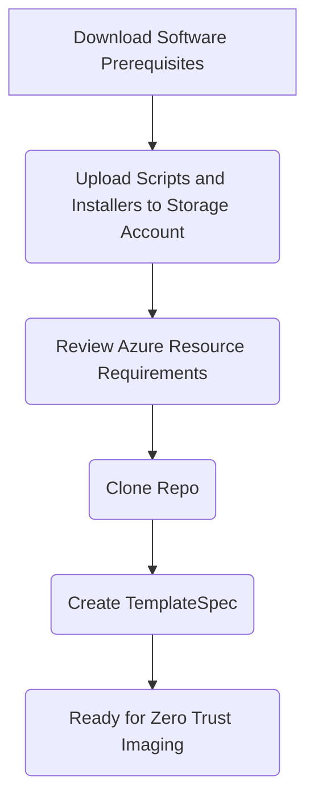

# Zero Trust and Azure Imaging

This zero trust imaging solution for Azure allows you create images in an Azure environment that adheres to zero trust. While other options exist in Azure, its either a manual process or it doesn't adhere to zero trust. Azure Image Builder (AIB) is a great imaging service in Azure but does not adhere to zero trust. The service creates a staging resource group with a storage account that cannot be configured with a private endpoint.  This breaks the zero trust principles. This solution uses a storage account with a private endpoint to store applications and the existing, preconfigured resources that comply with the principles.



## Prequisites

### Software

You must install Azure Bicep on your deployment workstation: [Azure Bicep](https://learn.microsoft.com/en-us/azure/azure-resource-manager/bicep/overview?tabs=bicep)

### Azure Resources and Supporting Scripts and Software

You have two options of preparing your environment - Either manually or by using a script

In either case, you must have the following prerequisites in place:

1. You must have a Virtual Network with at least one subnet.
2. You must have the Azure Private DNS Zone for [storage blobs](https://learn.microsoft.com/en-us/azure/private-link/private-endpoint-dns#storage) specific to your environment configured and linked to the VNet.

#### Manual

1. Create a new resource group and call it something that represents the purpose such as 'rg-imagemanagement-use' where the rg is the abbreviation for resource group and 'use' is the abbreviation for the location.
2. Create a new general purpose v2 [storage account](https://learn.microsoft.com/en-us/azure/storage/common/storage-account-create?tabs=azure-portal) and a blob container in the resource group. Be sure to add a private endpoint and configure the Azure Private DNS zone for blobs 'privatelink.blob.core._environmentSuffix_'.
3. Create an [Azure Compute Gallery](https://learn.microsoft.com/en-us/azure/virtual-machines/create-gallery?tabs=portal%2Cportaldirect%2Ccli2).
4. Upload the following files from the artifacts folder to your blob container via the portal:

    * cse_master_script.ps1
    * Get-ImageBuildValidations.ps1
    * Get-ImageVersionSource.ps1

5. Download the PowerShell Az Module by navigating to [releases](https://github.com/Azure/azure-powershell/releases) and scrolling down to 'Assets' under the latest release. Download the 'Az-Cmdlets-_version_-x64.msi' and place it in the PowerShell-Az-Module folder in the artifacts directory. Then zip up the directory contents (go in to the directory and select all files, then 'Send to Compressed file'.). Then upload this zip to the artifacts container.
6. Optionally, gather the following installers and upload them to their respective folders:

    * Download the [FSLogix Installer Zip File](https://aka.ms/fslogix_download) and save it to an empty temporary folder. Zip the folder contents up and upload it to the storage account blob container.
    * Download the [OneDrive Installer](https://go.microsoft.com/fwlink/p/?linkid=2121808) and save it to and empty temporary folder. Zip the folder contents and upload the zip to the storage account blob container.
    * Download the [Office Deployment Tool](https://www.microsoft.com/en-us/download/confirmation.aspx?id=49117) and save it to and empty temporary folder and zip the folder contents and upload the zip to the storage account blob container.
    * For Teams, download the following files to an empty temporary folder and then zip up the folder contents and upload the zip to the storage account:
      * [Visual Studio Redistributables](https://aka.ms/vs/17/release/vc_redist.x64.exe)
      * Remote Desktop WebRTC Redirector Service from the link on this [website](https://docs.microsoft.com/en-us/azure/virtual-desktop/teams-on-wvd)
      * Correct version of teams based on tenant type:
        * [Commercial](https://teams.microsoft.com/downloads/desktopurl?env=production&plat=windows&arch=x64&managedInstaller=true&download=true)
        * [Government Community Cloud (GCC)](https://teams.microsoft.com/downloads/desktopurl?env=production&plat=windows&arch=x64&managedInstaller=true&ring=general_gcc&download=true)
        * [Government Community Cloud High (GCCH)](https://gov.teams.microsoft.us/downloads/desktopurl?env=production&plat=windows&arch=x64&managedInstaller=true&download=true)
        * [Department of Defense](https://dod.teams.microsoft.us/downloads/desktopurl?env=production&plat=windows&arch=x64&managedInstaller=true&download=true)

#### Scripted

The script [Upload-ArtifactsToStorage.ps1](https://github.com/shawntmeyer/ZTAImageCreation/blob/master/Upload-ArtifactsToStorage.ps1) included at the root of this repo is parameterized and documented. It is designed to do the following (as needed):

1. Optionally, deploy an image artifacts storage account with blob container, user assigned identity for blob access, and a compute gallery for storing your images. This deployment is idempotent, so could be selected on each run of the script. Parameters for the image build resources are configured in the [imageManagement.parameters.json](https://github.com/shawntmeyer/ZTAImageCreation/blob/master/imageManagementResources/imageManagement.parameters.json) file. You control this option via the '-DeployRequisites' switch of PowerShell script.
2. Optionally, download new source files from public Internet sources based on the parameters set in the [downloads.parameters.json](https://github.com/shawntmeyer/ZTAImageCreation/blob/master/artifacts/downloads.parameters.json) file. You control this option via the '-DownloadNewSources' boolean parameter. For the first run of the script, you will most likely want to use this option to download at least the required PowerShell Az Module. If you want to download teams, you'll want to include the '-TeamsTenantType' parameter with possible string values = 'Commercial', 'DepartmentOfDefense', 'GovernmentCommunityCloud', or 'GovernmentCommunityCloudHigh'.
3. Compress all folders located inside the artifacts directory into the temp directory as zip files. Additionally, copy all files in the root of the artifacts directory into the temp directory.
4. Upload all files located in the temp directory to the artifacts container in the storage account.
5. Optionally, update the imageBuild parameters file with the artifacts storage account resource Id, user assigned identity resource Id, and compute gallery resource Id.

## Creating Template Spec

### Example

```powershell
New-AzTemplateSpec `
    -Name 'ZeroTrustImaging' `
    -ResourceGroupName rg-imagemanagement-locationabbreviation `
    -Version '1.0' `
    -Location location `
    -DisplayName "Zero Trust Image Template" `
    -TemplateFile '.\imagebuild.bicep' `
    -UIFormDefinitionFile '.\uiDefinition.json'  `
    -Force
```

## Adding Applications

You can add application to any image using the UI, parameters, or hard code them in via variables. Each option is spelled out below:

### UI Custom Installers


### parameters file

```json
"customizations": {
      "value": [
        {
          "name": "NotePad++",
          "blobName": "Notepad++.msi",
          "arguments": "/quiet /norestart"
        },
        {
          "name": "VSCode",
          "blobName": "VSCode.zip",
          "arguments": ""
        }
      ]
    },
```

### Hard Code them via variables

* Add additional applications by adding additional blocks of installers in the 'imageBuild.bicep' via the 'installers' variable.
* Any blob called will have to be uploaded to the storage account and container that are defined in the parameter set

```bicep
var installers = [
    {
        name: 'myapp1'
        blobName: 'software1.exe'
        arguments: '/S'
    }
    {
        name: 'myapp2'
        blobName: 'software2.exe'
        arguments: '/S'
    }
]
```

## Troubleshooting

### View Run Command Status

The applications are installed using the Run Command extension on the Azure virtual machine.  To the view and troubleshoot the status of a Run Command use the example below:

``` powershell
PS C:\git\ztaimage> $x = Get-AzVMRunCommand -ResourceGroupName rg-image -VMName vm-image -RunCommandName office -Expand InstanceView
PS C:\git\ztaimage> $x.InstanceView


ExecutionState   : Running
ExecutionMessage :
ExitCode         : 0
Output           :
Error            :
StartTime        : 8/2/2023 2:14:27 PM
EndTime          :
Statuses         :
```
